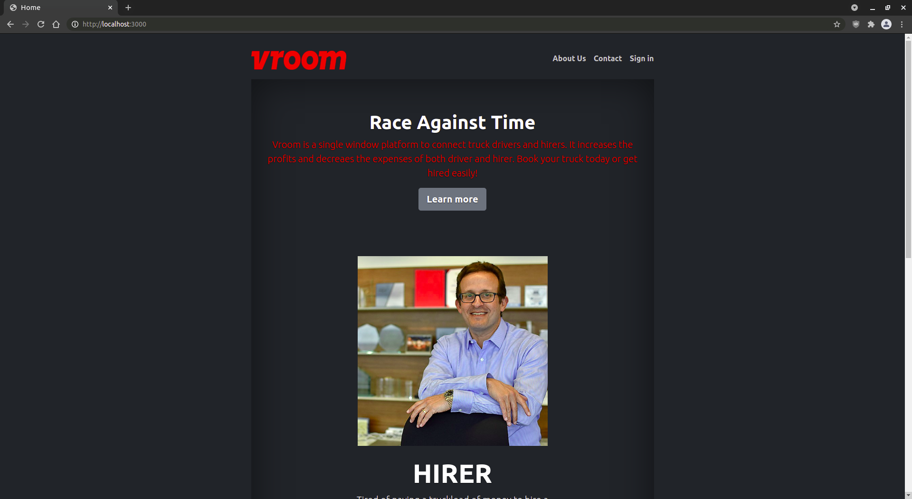
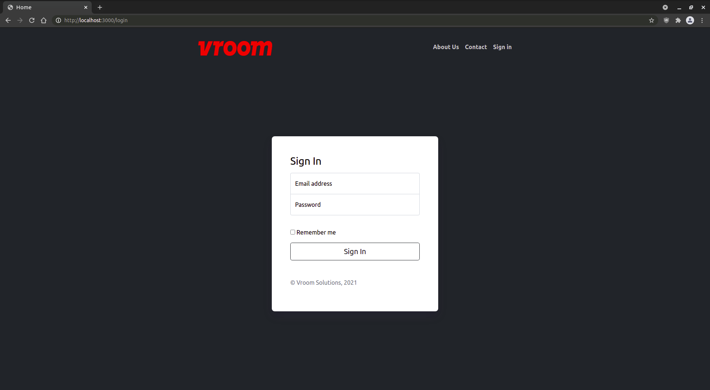
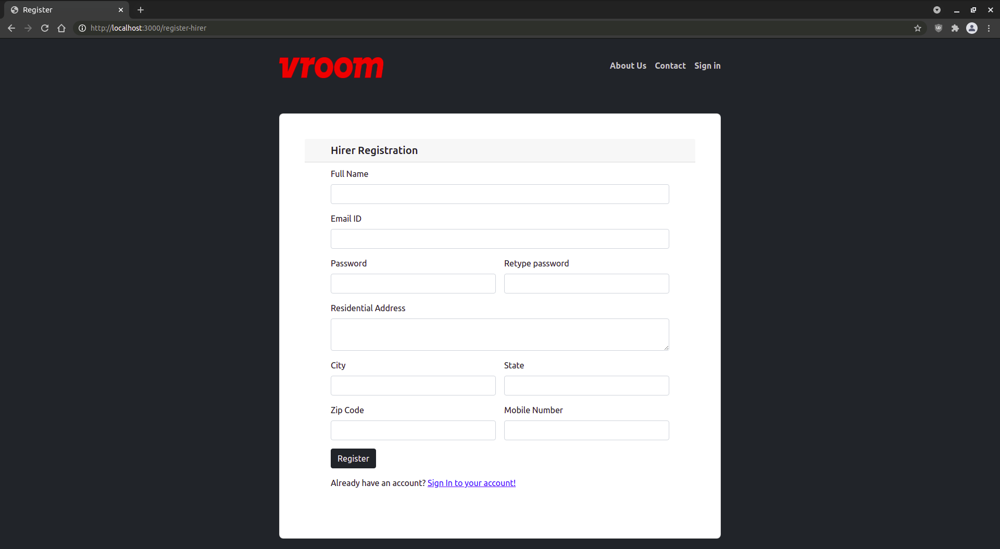
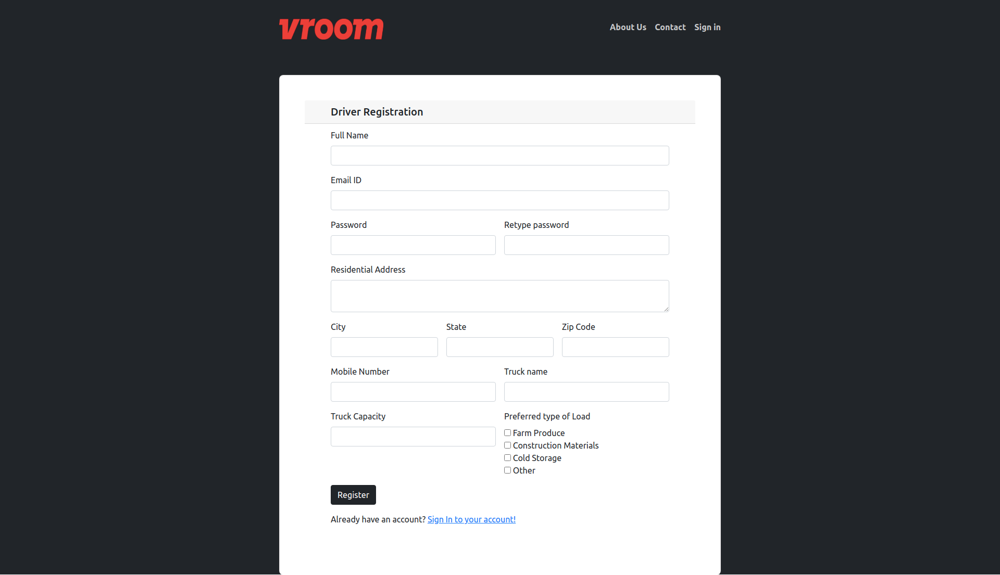
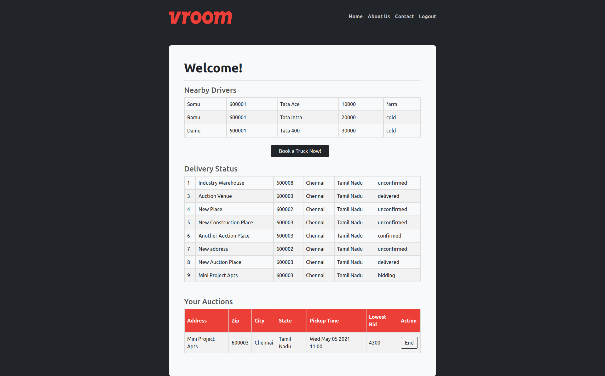
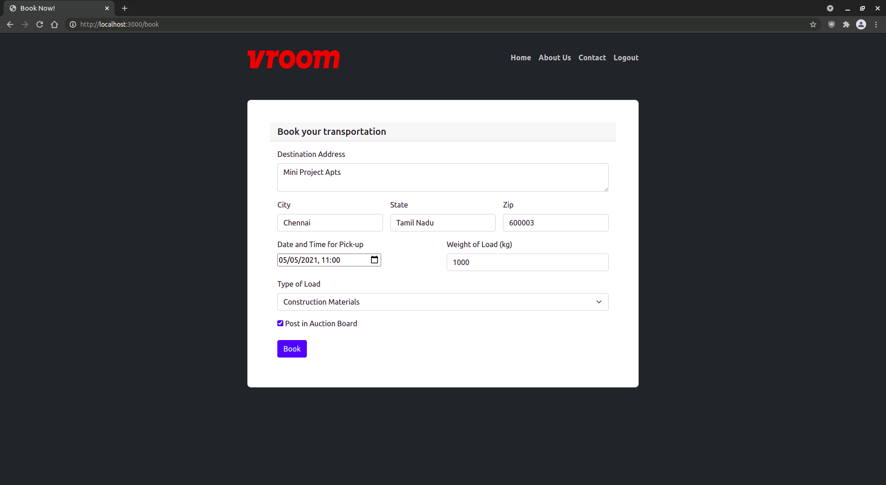
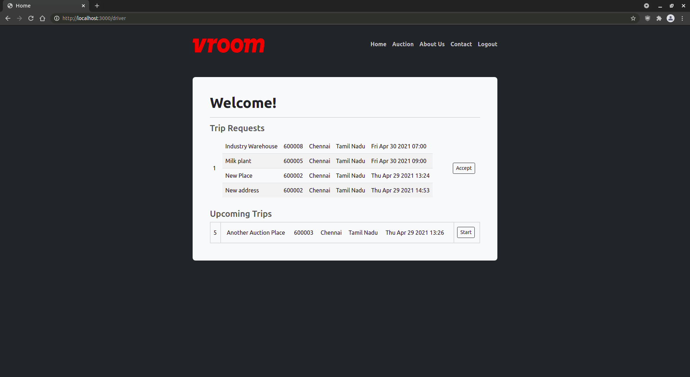
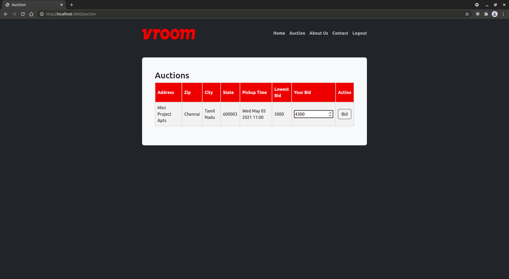

## How to configure

1. Clone the repo
2. cd into the directory and run 'npm install' (should install all the dependencies)
3. Create .env file and create DB and sample tables in MySQL (using the statements in sql.txt)
4. run 'node index.js'

## .env File - 
MYSQL_HOST=localhost  
MYSQL_USER=username  
MYSQL_PASSWORD=password  
MYSQL_DB=vroom  
SESSION_SECRET=giveanysessionsecrethere

## Output Screenshots - 
### Main Homepage : 

### Login page : 

### Hirer registration :

### Driver registration :

### Hirer's homepage :

### Truck booking page :

### Driver's homepage :

### Auctions page :

